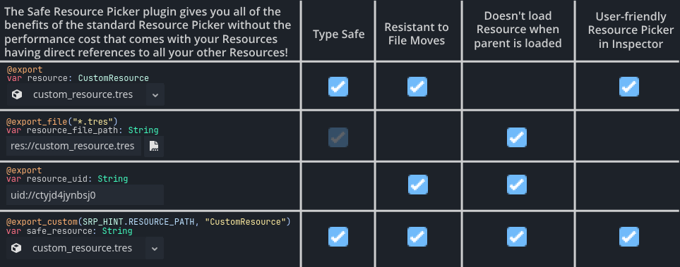

# Safe Resource Picker Editor Plugin




If you've ever written `@export var scene: PackedScene` or `@export var item: CustomResource` in your resource or node to store data, then you're benefitting from the type safety of the Godot Inspector ensuring that only `PackedScene` or `CustomResource` values can be stored in your property. However, now your resource or node contains that entire resource, too, and whenever your resource or node loads, so does that resource!

It's much more performant to write `@export var scene_path: String` and then use `var scene: PackedScene = load(scene_path)` later, but now the Inspector just shows a text field for that property, and *anything* can go in there!

With the **Safe Resource Picker**, you can write `@export_custom(SRP_HINT.RESOURCE_PATH, "PackedScene") var scene_path: String` and get the performance benefits of only storing a string with the Inspector interface of selecting a resource!

In addition to performance benefits, it makes possible something that you can't normally accomplish with Custom Resources: cyclical references! If you've ever gotten the "Recursion detected, unable to assign resource to property" error when you wanted Resource A and Resource B to reference to each other, use the **Safe Resource Picker** and this limitation is gone!

# Installation

Download from the Godot Asset Library or GitHub and put the `safe_resource_picker` directory in your project's `res://addons` directory. Go to your Project Settings and enable the **Safe Resource Picker** plugin.

# Usage

Anywhere you want to store a Resource path, use `@export_custom(SRP_HINT.RESOURCE_PATH, "ResourceType")`, like so:

```GDScript
@export_custom(SRP_HINT.RESOURCE_PATH, "PackedScene") var scene_path: String

func get_scene() -> PackedScene:
	return load(scene_path)
```

For an Array of Resources, use the same `@export_custom` annotation on an `Array`, `Array[String]`, `Array[StringName]` or `PackedStringArray` variable.

## ResourceUidLoader

There's also a `ResourceUidLoader` node that uses `ResourceLoader.load_threaded_request` behind the scenes to load resources and emit signals when they're loaded. This exists for the Array editor implementation, but can likely be used by your own project as well. As it inherits from `Node`, you will either need to add it to your scenes or add it to your project as an Autoload to use it.

## Limitations

The experience for Arrays is slightly different than the native Godot Array inspector.

Dictionaries with Resources as the keys or values are not supported. As recreating the Dictionary editor in GDScript would be a massive undertaking, this is unlikely to change.

# Future

 - This plugin will be maintained to ensure its compatibility with all future Godot versions.
 - If any bugs are found, they will be fixed.
 - Documentation may be updated to be more clear if needed.
 - In the event that a new version of Godot surfaces Dictionary-editing controls in GDScript, Dictionary support may be added at that time.
 - I would like to make the Array editor match the native Godot editor a bit better (highlighting the panel when it's expanded) but to my knowledge this is not feasible unless the engine surfaces more editor controls in GDScript as well.
 - The Godot Editor doesn't seem to translate error strings right now. If this ever changes, it would be nice to have translations for the two error strings this plugin can emit.
 - Other new features are unlikely.
